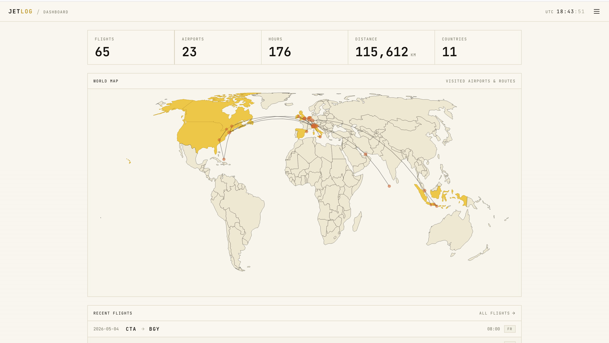
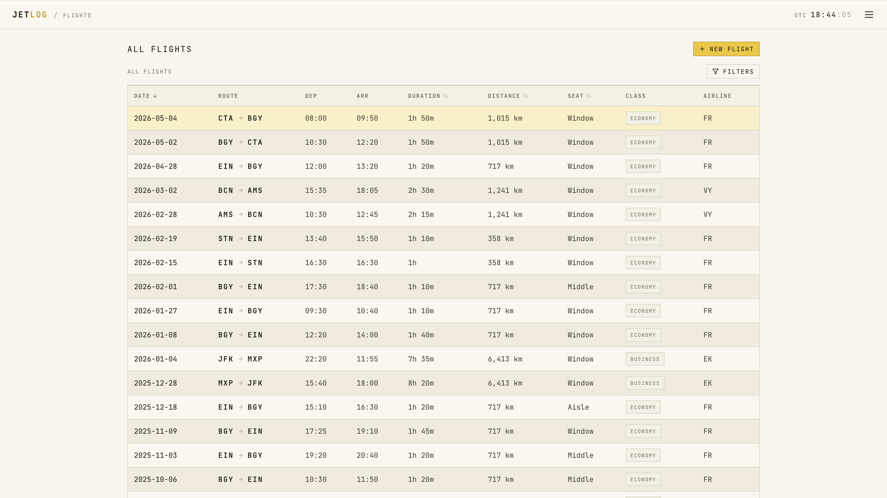

# jetlog

<p align="center">
    
    
</p>

A self-hostable personal flight tracker and viewer

|
:--------------------------------------:|:---------------------------------------------:

## Table of Contents

- [Features](#features)
- [Getting Started](#getting-started)
- [Importing & Exporting](#importing--exporting)
- [Privacy Notice](#privacy-notice)
- [Contributing](#contributing)
- [Stack](#stack)
- [Acknowledgements](#acknowledgements)

## Features

- 🌍 World map view of your flights
- 📊 Statistics for all your flights
- 📱 Responsive design
- ✅ Add, edit, and delete past flights
- 🔐 Secure authentication
- 👥 Support for multiple users
- 💾 Ability to import and export your data


## Getting Started

Here's a sample `docker-compose.yml` to get started
```yml
services:
  jetlog:
    image: pbogre/jetlog:latest
    volumes:
      - /your/data/path:/data
    environment:
        JETLOG_PORT: 3000 # optional, default is 3000
        SECRET_KEY: yourLongAndRandomStringOfCharacters123!
    restart: unless-stopped
    ports:
      - 3000:3000
```

Once up and running, the default admin account has username and password `admin`. 
Make sure that you change the password after the first login!

For details about troubleshooting, environment variables, and more installation options
such as running Jetlog under a path prefix, have a look at the [installation wiki](https://github.com/pbogre/jetlog/wiki/Installation)

## Importing & Exporting

You can currently import from MyFlightRadar24, custom CSV;
you can also export to CSV, iCal

For details on how to import your data, have a look at the [importing wiki](https://github.com/pbogre/jetlog/wiki/Importing)

## Privacy Notice

Jetlog itself does not collect any user data outside of your own setup. However,
it relies on external APIs ([adsbdb](https://www.adsbdb.com/)) for some features
such as automatic flight fetching from the flight number. Since you cannot always
be sure of how external APIs use your data, you may wish to opt out of these by setting
the `ENABLE_EXTERNAL_APIS` environment variable to `false`.

## Contributing

If you would like to contribute to this project by opening an issue or a pull request, 
please read [CONTRIBUTING.md](https://github.com/pbogre/jetlog/blob/main/CONTRIBUTING.md)

## Stack

- [FastAPI](https://fastapi.tiangolo.com/)
- [SQLite](https://www.sqlite.org/)
- [React](https://react.dev/)
- [TailwindCSS](https://tailwindcss.com/)

## Acknowledgements

- [Favicon](https://www.flaticon.com/free-icon/flight_16863550?term=plane&page=1&position=36&origin=search&related_id=16863550)
- [Airports data](https://ourairports.com/)
- [react-simple-map](https://www.react-simple-maps.io/)
- [World GeoJSON](https://geojson-maps.kyd.au/)
- [adsbdb API](https://www.adsbdb.com/)
